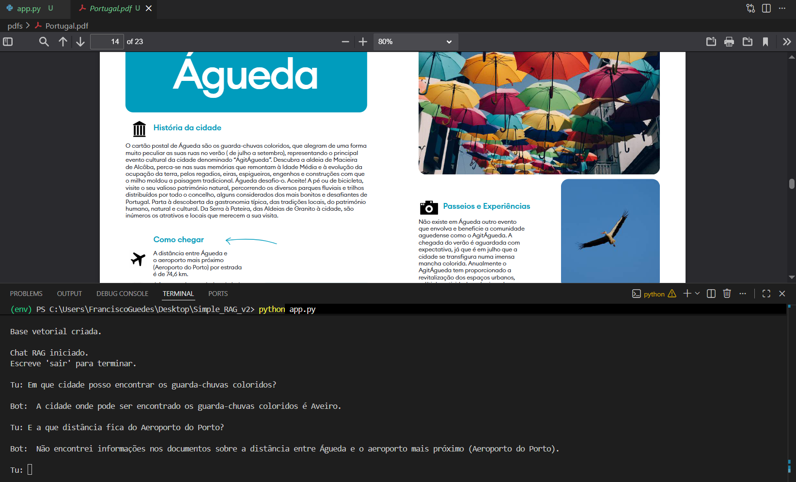

# RAG LOCAL COM PDFS + CHROMADB PERSISTENTE + OLLAMA

Este projeto implementa um sistema **RAG (Retrieval-Augmented Generation)** local com suporte a chat, utilizando:

- **PDFs** como base de conhecimento
- **ChromaDB** com persistência local
- **Sentence** Transformers para embeddings
- **Ollama + Mistral** para gerar respostas  
- **Histórico** de conversa (chat memory)

---

# 🚀 COMO FUNCIONA

## Fluxo do sistema:

PDFs → Extração de texto → Chunking → Embeddings → ChromaDB (persistente)

Pergunta → Embedding → Pesquisa semântica → Prompt(Contexto) + Histórico → Mistral → Resposta

---

# 📦 TECNOLOGIAS

- Python
- ChromaDB (PersistentClient)
- Sentence Transformers
- Ollama
- Mistral
- PyPDF

---

# ⚙️ INSTALAÇÃO

## 1. Criar ambiente virtual

```bash
python -m venv env
```

---

## 2. Ativar ambiente virtual

### Windows

```bash
env\Scripts\activate
```

## 3. Instalar dependências

```bash
pip install -r .\requirements.txt
```

---

## 4. Instalar modelo Ollama

```bash
ollama pull mistral
```

---

# 📂 ESTRUTURA DO PROJETO

project/
├── app.py
├── chroma_db/
├── README.md
├── Images/
│   └── saida.png
└── pdfs/
    ├── documento1.pdf
    ├── documento2.pdf
    └── documento3.pdf

---

# 🧠 FUNCIONAMENTO TÉCNICO

## 1. Indexação dos PDFs

- Lê todos os PDFs da pasta `pdfs/`
- Extrai texto
- Divide em chunks
- Gera embeddings
- Guarda no ChromaDB persistente

---

## 2. Pesquisa Semântica

- A pergunta é convertida em embedding
- O sistema procura os chunks mais relevantes
- Retorna contexto relevante

---

## 3. Geração de Resposta

O modelo Mistral recebe:

- Contexto dos PDFs
- Histórico da conversa
- Pergunta atual

E gera uma resposta baseada nesses dados.

---

## 4. Memória de Chat

O sistema mantém histórico da conversa:

- Permite perguntas de seguimento
- Mantém contexto da interação
- Melhora coerência das respostas

---

## 💾 PERSISTÊNCIA (CHROMADB)

Este projeto utiliza:

chromadb.PersistentClient(path="./chroma_db")

Isto significa:

- Os embeddings ficam guardados no disco
- Não é necessário reprocessar PDFs sempre
- Apenas novos PDFs precisam ser adicionados

---

# ▶️ Executar Projeto

```bash
python main.py
```

---

# 💬 EXEMPLO DE UTILIZAÇÃO

Chat RAG iniciado.
Escreve 'sair' para terminar.

Tu: Em que cidade posso encontrar os guarda-chuvas coloridos? 

Bot:  A cidade onde pode ser encontrado os guarda-chuvas coloridos é Aveiro.

Tu: E a que distância fica do Aeroporto do Porto?

Bot:  Não encontrei informações nos documentos sobre a distância entre Águeda e o aeroporto mais próximo (Aeroporto do Porto).

---

# 🖼️ EXEMPLOS

Ver pasta:



Contém prints de conversas reais com o sistema.

---

⚠️ 
Nota técnica: algumas respostas podem não ser totalmente precisas devido às limitações do pipeline RAG utilizado.

Este comportamento pode ser causado por:
- Divisão de texto em chunks (chunking), que pode separar informação relacionada
- Uso do modelo de embeddings "all-MiniLM-L6-v2", que é leve mas menos preciso em relações semânticas complexas
- Limitações na recuperação dos chunks mais relevantes (top-k retrieval)
- Limitações do modelo LLM (Mistral), que pode não utilizar todo o contexto fornecido

Este é um comportamento esperado em sistemas RAG simplificados e pode ser melhorado com modelos de embeddings mais avançados

---

---

# ⭐ DIFERENÇAS IMPORTANTES (VS VERSÃO 1)

- Usa ChromaDB persistente (não recria base sempre)
- Inclui chat history
- Sistema mais eficiente
- Melhor experiência de conversa

---

# ⭐ Resumo

Este projeto cria um assistente inteligente local especializado em turismo em Portugal, capaz de analisar os documentos PDF fornecidos e responder a perguntas sobre destinos, atrações, monumentos, gastronomia, cultura e locais de interesse turístico. Utilizando tecnologia RAG com IA, o sistema pesquisa automaticamente a informação mais relevante nos PDFs e gera respostas claras e contextualizadas. Adicionalmente, mantém histórico de conversação, permitindo continuidade no diálogo e melhor compreensão de perguntas subsequentes.

---

# 👤 AUTOR

Francisco Guedes